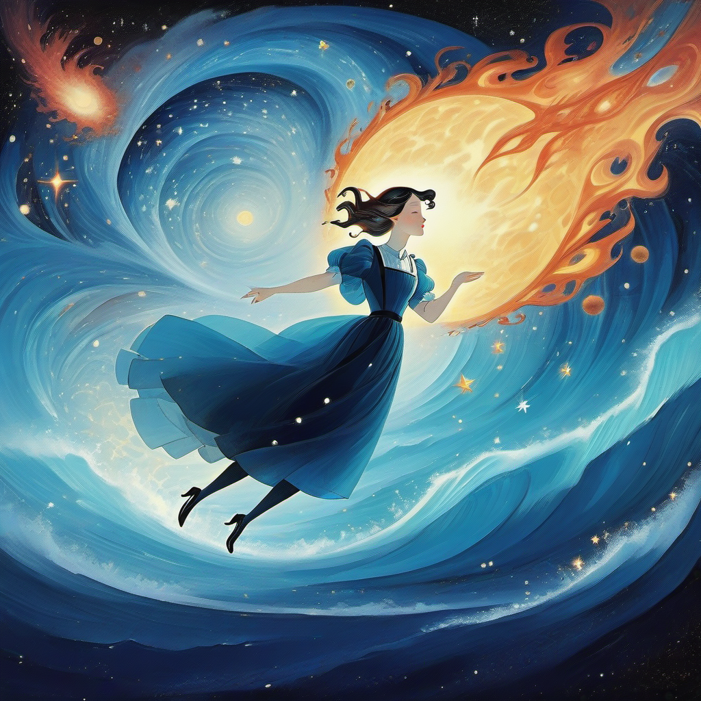

Passion is not mastery,

Strong feelings are

neither facts nor keen understanding.

Our convictions take courage,

to swim against the current,

to be true.

That ceaseless flow spares no one.

We drown in knowledge,

and we feel we know that ocean.

Our souls cry for others,

our minds eject what they can

to take on new horrors, bold.

We are finite,

foaming at the mouth,

of infinite arrays of information, in scores.

We know enough to react,

but often not enough,

to prevent the tragedies that come our way, and more.

Things are euphoric or vicious,

and then,

they are washed away.

For many, a lack of knowledge leads to

fanaticism on the subject at hand.

They attack what they don’t grasp,

and sway.

It is beautiful to be bold and unabashed,

but propaganda works best on the beautiful, alas.

Look carefully before you misguide another’s gaze,

before lunging into false battles,

with no end in sight, and pass.

Passion is not expertise,

but neither is a restrained armchair view.

And I’d take the passionate over the poised any day,

with delight, anew.

Between the empathetic and apathetic,

the former will get informed,

As long as they’re not caught up

in some performance,

they’ll learn, and be transformed.

